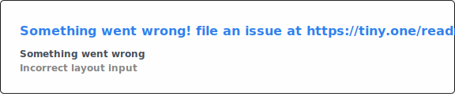

<div align="center">

```
虚
```

</div>

<br>

```bash
> whois voidashi

USER       : jefferson · jeff
ALIAS      : void · voidashi
LOCATION   : são carlos, sp — br
FIELD      : computer science @ usp · data security
DOMAINS    : systems · security · low-level · web
ENV        : arch linux · hyprland · neovim
STATUS     : [active]
```

<br>

<div align="center">

[](#)
[](#)
[](#)
[](#)
[](#)
[](#)
[](#)

</div>

<br>

<div align="center">


&nbsp;


</div>

<br>

<div align="center">

[](https://虚.net)
[](mailto:jeffmbueno@duck.com)
[](https://github.com/voidashi)
[](https://twitter.com/jeffmzb)
[](https://instagram.com/jeffmzb)
[](https://t.me/jeffmbueno)

</div>

<br>

<div align="center">

*the void is not empty. it waits.*

</div>

<br>

<div align="center">

```
閉
```

</div>
